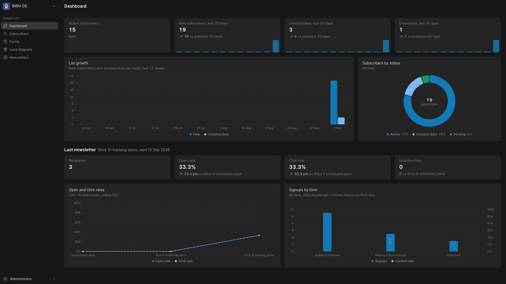
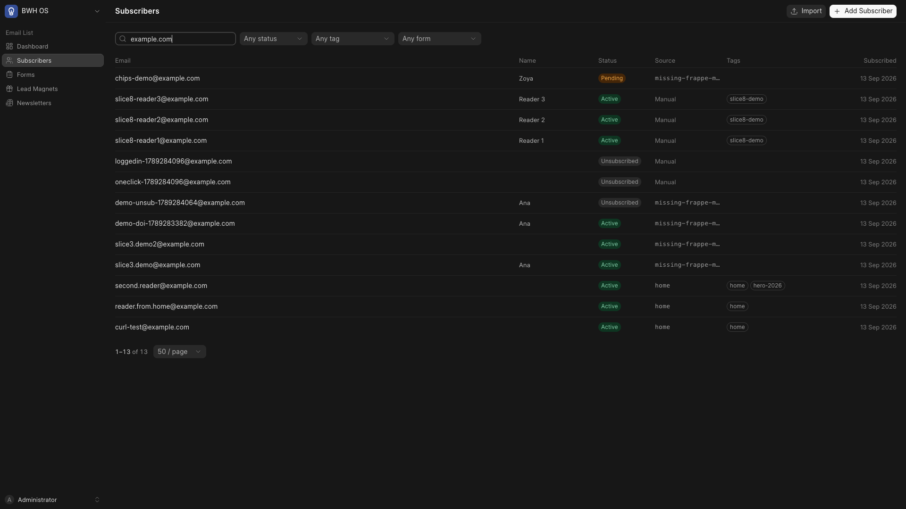
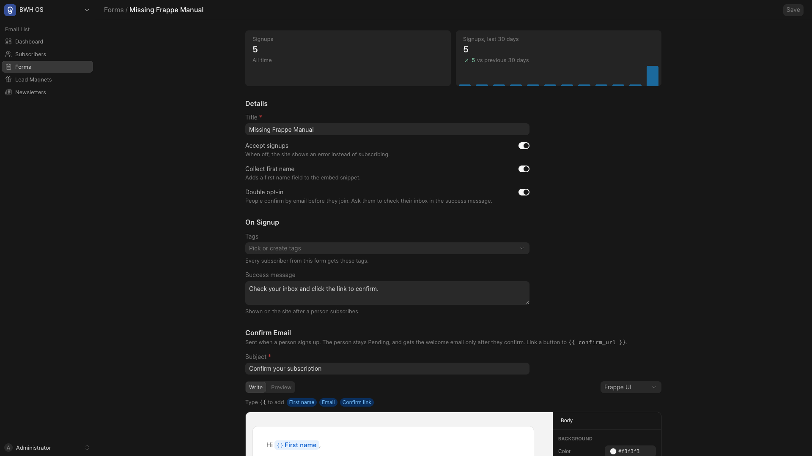
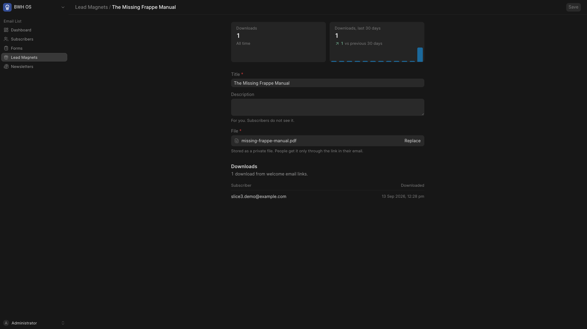
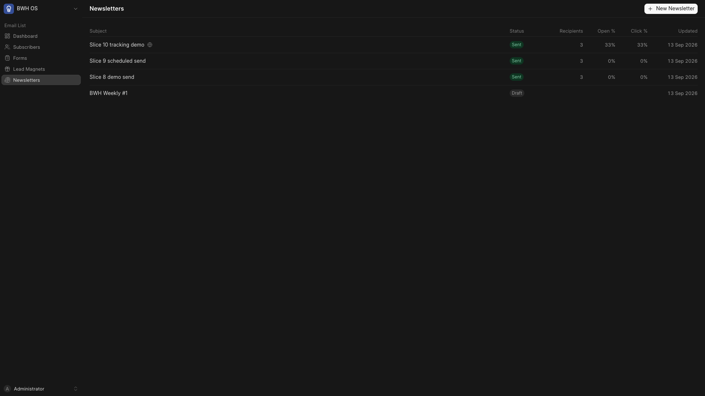
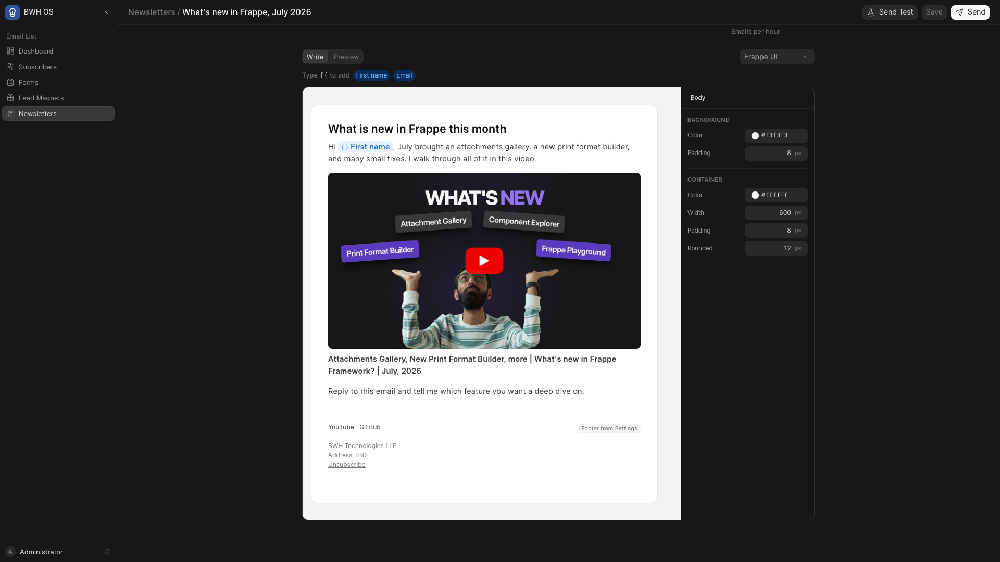
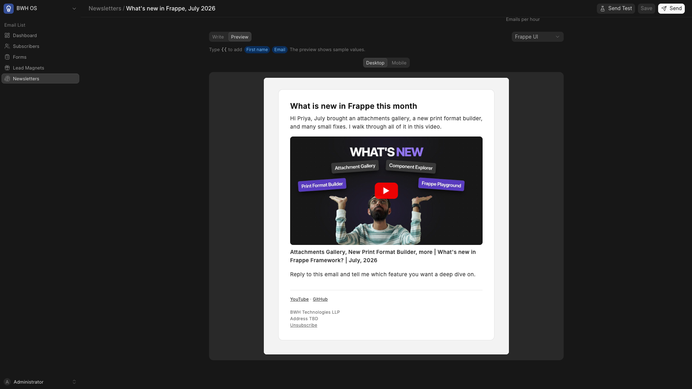
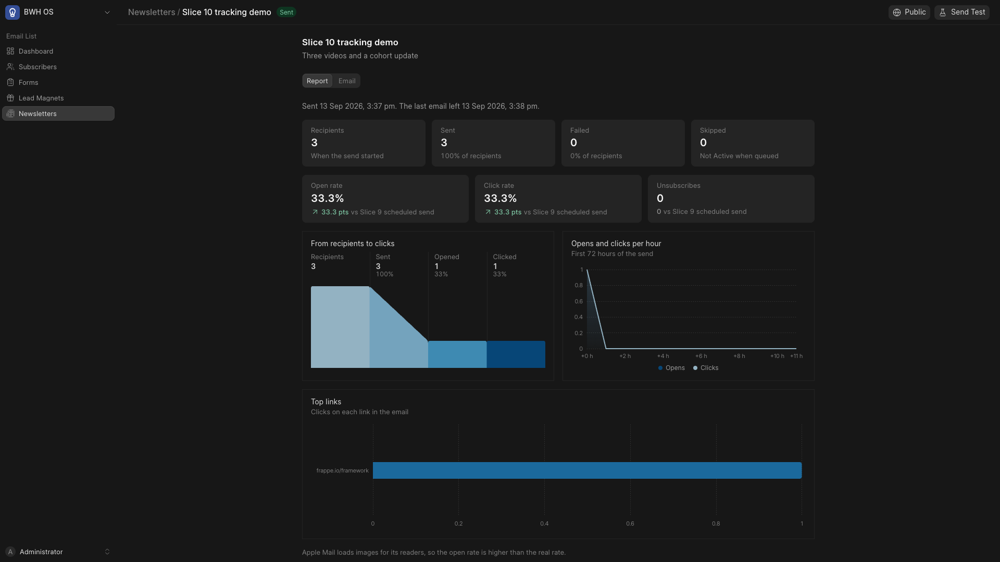
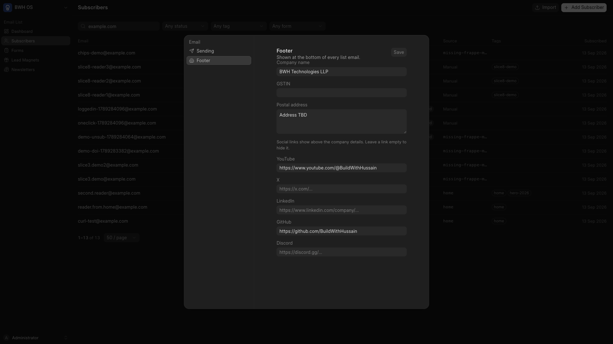

# BWH OS

BWH OS is the control panel for BWH Media & Products. It is a [Frappe](https://frappe.io/framework) app with a [frappe-ui](https://ui.frappe.io) frontend at `/os`.

BWH runs a YouTube channel, cohorts, open-source products, and client work. The data for this work is in many tools. BWH OS puts the work in one place, and BWH owns the data.

The first module is the email list. See [specs/README.md](specs/README.md) for the full plan.

## Features

### Dashboard

The dashboard shows the growth of the list, subscribers by status, and the stats of the last newsletter. It also shows open and click rates for the last 10 newsletters, and signups and the confirm rate for each signup form.



### Subscribers

- One list with tags. One unsubscribe removes a person from all sends.
- Filter by status, tag, and signup form. Search by email.
- Add a subscriber by hand.
- Import a CSV file. Map the columns, pick tags, and see what the import does before it starts. The import runs in a background job.



### Signup forms

- Each form has an ID. A website sends signups to the `subscribe` API with this ID.
- Single or double opt-in, set on each form.
- Tags to add on signup, a success message, and an optional lead magnet.
- A confirm email and a welcome email for each form, written in the email editor.
- The form page shows signup counts and the embed snippet.



### Lead magnets

A lead magnet is a private file, for example a PDF, with its own delivery email attached. It gets
its own page at `/download/<route>`, and the link in an email carries the reader's token. The page
shows the title and a button; only the button hands the file over, so a mail scanner following the
link is not counted as a reader. Each download is logged.

A signup form can give a magnet away: the form's welcome email (a plain greeting) goes first, then
the magnet's own email with the file. Only a magnet with its own delivery email can be linked to a
form.



### Newsletters



#### Email editor

Every email in OS uses the same editor. The editor is [React Email editor](https://react.email/docs/editor/overview) in a shadow root inside the Vue app.

- Type `/` for blocks: headings, lists, buttons, columns, code, and more.
- Type `{{` to add a variable, for example the first name of the subscriber.
- **YouTube video block.** Paste a YouTube link on its own line. The block shows the thumbnail with a play button and the title, and links to the video.
- **Footer block.** The block shows the social links, the company details, and the unsubscribe link from Settings. An email without the block gets the footer at the end.
- Three themes: Frappe UI, Basic, and Minimal.
- Press Cmd+S or Ctrl+S to save a draft.



#### Preview and send

- Preview the email at desktop and mobile width, with sample values.
- Send a test to any address.
- Send to all Active subscribers, or to subscribers with some tags. The page shows the recipient count before the send.
- Emails go out in hourly batches. Each newsletter has an hourly limit.
- Send now, or schedule the send for later.



#### Report

- Counts for recipients, sent, failed, and skipped emails.
- Open rate, click rate, and unsubscribes, each against the previous newsletter.
- A funnel from recipients to clicks, opens and clicks per hour, and the top links.
- Publish a sent newsletter to the web archive at `/newsletter/<route>`.



### Social posts

Write a post once, see it as each platform would show it, and give it a time. Posts sit on
the same calendar as the videos they promote.

- **Channels.** A LinkedIn personal profile and an X account, connected from Settings.
  Tokens live in the Frappe `Token Cache`, never on the channel. X renews its own token in
  the background; LinkedIn cannot, so the OS marks the channel Expired the day its 60 days
  run out and emails a reminder a week before.
- **The composer.** One text for every channel, or a text written for one channel alone.
  Part 1 is the post; the parts after it are the X thread or the LinkedIn first comment.
  Images and video attach to a part, and X takes who may reply to the thread.
- **What each platform says.** The server counts and checks while you type, so the length,
  the media rules and a dead channel show up before a publish does. X counts weight, not
  characters: a link is 23 whatever its length and an emoji is two.
- **Publishing.** Publish now, or pick a time and let the minute send it. Each channel goes
  on its own, so one failing leaves the rest alone: the post is Published, Partial or
  Failed, and every channel keeps its link or its error. A failed channel can go again, a
  post that went nowhere goes back to a draft, and a post that half landed is copied to the
  channels that missed it.
- **The calendar.** Posts and `BWH Video.publish_on` on one month view. Drag a post to move
  it, click a day to start one.

#### Connecting the platforms

Both platforms need an app of their own. Settings shows the redirect URI to register and
takes the client id and secret.

**LinkedIn.** Make an app at [LinkedIn developers](https://www.linkedin.com/developers/apps),
add the products *Sign In with LinkedIn using OpenID Connect* and *Share on LinkedIn*, and
register the redirect URI from the panel. The OS asks for `openid`, `profile` and
`w_member_social`.

**X.** Make an app at the [X developer portal](https://developer.x.com), set it up as a
confidential client with OAuth 2.0, and register the callback URI from the panel. The OS
asks for `tweet.read`, `tweet.write`, `users.read`, `media.write` and `offline.access`. A
channel connected before `media.write` was asked for can post text and nothing else, so
connect it again to put pictures on a tweet.

**The site.** A scheduled post goes out on the minute only if the scheduler ticks that
often:

```bash
bench set-config -g scheduler_tick_interval 60
```

Without it the scheduler ticks every 4 minutes, and a post goes out within 4 minutes of its
time. Video needs room to arrive, in the site and in whatever proxy sits in front of it:

```bash
bench set-config -g max_file_size 524288000   # 500 MB
```

Locally, LinkedIn and X both refuse `bwhos.localhost` as a redirect host. Set
`"host_name": "http://localhost:8000"` in `site_config.json` and open the OS at
`http://localhost:8000/os`, or put a tunnel in front of the site.

### Settings

The Settings dialog sets the email account that sends list email, the default hourly limit, and the footer: the company name, GSTIN, postal address, and social links.



## Upcoming

### Email list

- Show the confirm rate on the signup form page.
- Connect the signup form on bwh.tech to the `subscribe` API through the Netlify function.
- Set the sending subdomain and From address, for example `mail.bwh.tech`.
- Add the GSTIN and the registered address of BWH Technologies LLP to Settings.

These items are out of scope for v1. They can come later:

- Drip and automation sequences.
- Bounce and complaint processing, with a webhook from the email provider.
- Captcha on signup forms.
- Live sync of new LMS users.
- Segments from opens and clicks.
- Resend to people who did not open.
- More than one list.

### New modules

| # | Module | Plan |
|---|---|---|
| 04 | YouTube Integration | Sync the channel videos. Find and replace text in descriptions, update calls to action on many videos, and find videos with no chapters or playlists. |
| 05 | LMS Integration | Show live cohorts, seats sold, and revenue for each batch from school.bwh.tech. |
| 06 | GitHub Integration | Show stars, open issues, open pull requests, and releases for the core products. |

## Installation

Install this app with the [bench](https://github.com/frappe/bench) CLI:

```bash
cd $PATH_TO_YOUR_BENCH
bench get-app $URL_OF_THIS_REPO --branch develop
bench install-app bwh_os
```

Only users with the System Manager role can open `/os`.

## Development

### Frontend

The frontend is in the `frontend` folder. The Vite dev server sends API calls to port 8000.

```bash
cd frontend
yarn install
yarn dev
```

`yarn build` builds the app into `bwh_os/public/frontend` and `bwh_os/www/os.html`.

### Local email

1. Start [Mailpit](https://mailpit.axllent.org) in Docker, with SMTP on port 1025 and the web UI on port 8025.
2. Make an Email Account that sends through `localhost:1025` with no auth and no TLS.
3. Select that Email Account in Settings.
4. Open `http://localhost:8025` to read the emails that OS sends.

### Tests

```bash
bench --site $SITE run-tests --app bwh_os
```

The frontend has a few tests of its own, for the code that has to agree with the server.
They run on Node's own test runner, so there is nothing to install:

```bash
cd frontend && yarn test
```

## Contributing

This app uses `pre-commit` for code formatting and linting. [Install pre-commit](https://pre-commit.com/#installation) and enable it for this repository:

```bash
cd apps/bwh_os
pre-commit install
```

Pre-commit uses these tools to check and format the code:

- ruff
- eslint
- prettier
- pyupgrade

## CI

This app uses GitHub Actions for CI:

- CI: installs this app and runs the unit tests on every push to the `develop` branch.
- Linters: runs [Frappe Semgrep Rules](https://github.com/frappe/semgrep-rules) and [pip-audit](https://pypi.org/project/pip-audit/) on every pull request.

## License

MIT
